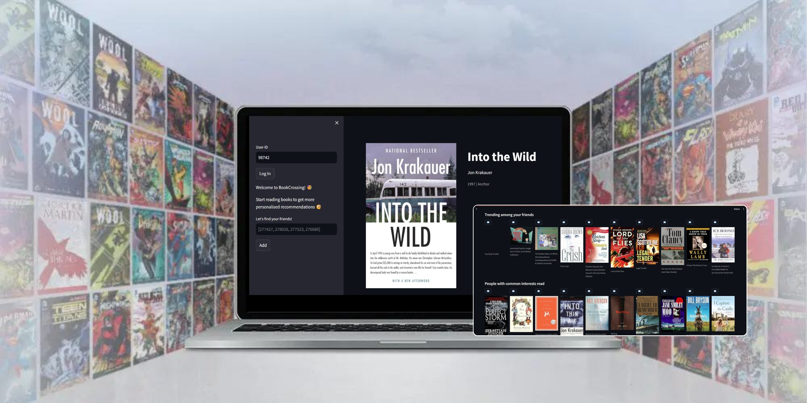
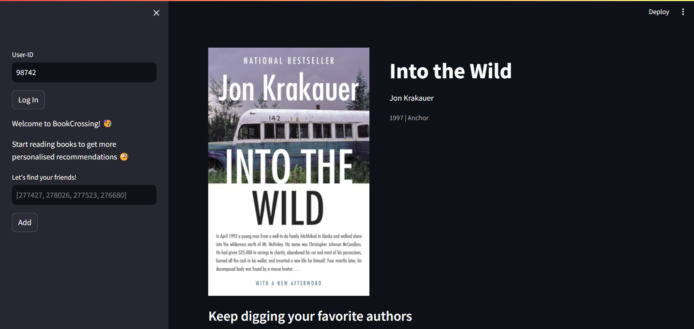
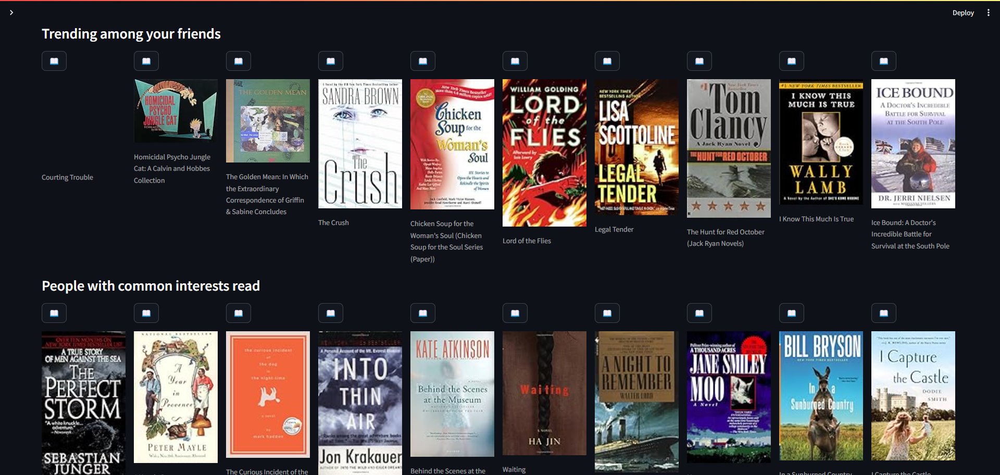

# ReadQuest: A Personalized Book Recommendation System

<p align="center">
    <div class="row">
        
    </div>
    <div class="row">
        
        
    </div>
</p>

## Project Overview

ReadQuest is an intelligent book recommendation system designed to help users discover their next favorite read. By leveraging user preferences, ratings, and social connections, ReadQuest provides personalized book recommendations. The system utilizes a combination of collaborative filtering and content-based filtering techniques to suggest books that align with the user's interests.

## Features

- **Personalized Recommendations**: Get book suggestions based on your previous reads and favorite authors.
- **Social Recommendations**: Discover books trending among your friends on the platform.
- **Common Interests**: Find books that people with similar tastes are reading.
- **User Interaction**: Log in, add friends, and explore books within a user-friendly interface.

## Installation

1. Clone the repository:
    ```bash
    git clone https://github.com/Pathakdarshan12/ReadQuest_Book_Recommender.git
    ```
2. Navigate to the project directory:
    ```bash
    cd readquest
    ```
3. Install the required dependencies:
    ```bash
    pip install -r requirements.txt
    ```
4. Run the Streamlit application:
    ```bash
    streamlit run app.py
    ```

## Dataset

The project uses the Book-Crossing dataset, which includes:
- `BX-Books.csv`: Contains book details such as ISBN, title, author, year of publication, and publisher.
- `BX-Book-Ratings-Subset.csv`: Contains book ratings provided by users.
- `BX-Users.csv`: Contains user information.

## File Structure

- `app.py`: Main application file containing the Streamlit code.
- `template.py`: Contains template functions used in the application for handling user interactions and displaying recommendations.
- `assets/`: Directory containing the assets.

## How It Works

### Initialization

- The application initializes with a default book and user to kickstart the interface.
- A default friends list is provided for generating social recommendations.
- A consent message regarding data privacy is shown to the user on their first visit.

### Recommendations

1. **Favorite Authors**:
   - Displays books by authors that the user has previously rated but hasn't read yet.
   - Recommends up to 10 books from these authors.

2. **Trending Among Friends**:
   - Displays books that are popular among the user's friends.
   - Recommends up to 10 books.

3. **Common Interests**:
   - Uses the Jaccard distance to find users with similar book ratings.
   - Recommends books that these similar users have read, but the current user hasn't.

### Sidebar Functionality

- **User Login**:
  - Allows users to log in with their User-ID.
  - Displays appropriate messages based on whether the User-ID exists in the dataset.
- **Add Friends**:
  - Allows users to add friends by entering their User-ID.
  - Checks if the friend is already in the list or if the User-ID exists in the dataset.

## Data Privacy

- ReadQuest respects user data privacy and complies with GDPR.
- Personal data is pseudonymized and encrypted, used only for recommendation purposes.

## License

This project is licensed under the MIT License.

## Contact


## Contact

<p align="left">
<a href="https://www.linkedin.com/in/pathakdarshan12/" target="blank">
    
</a>
<a href="https://x.com/_Pathak_Darshan" target="blank">
    
</a>
<a href="https://www.instagram.com/pathakdarshan12/" target="blank">
    
</a>
<a href="mailto:pathakdarshan12@gmail.com" target="blank">
    
</a>
</p>


---

Enjoy discovering your next favorite book with ReadQuest!

